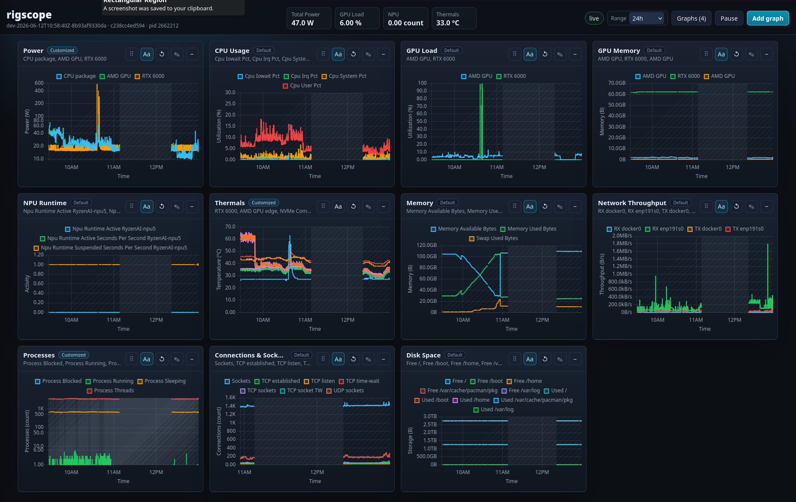

# rigscope

`rigscope` is a continuous hardware telemetry service for power and performance experiments. It autodetects local sensors, stores samples in an embedded time-series database, and serves a browser UI for graphs.



The binary is both the daemon and the CLI. Use `rigscope serve` to run the daemon; use commands such as `rigscope status` and `rigscope metrics` to query the running daemon over HTTP.

The old workload/event runner still exists as a legacy command, but the current direction is an always-on monitor first. Workload events and stdout-fed datapoints are intentionally deferred.

## Quick Start

```bash
go run ./cmd/rigscope serve
```

Then open:

```text
http://127.0.0.1:7077
```

For development, use the auto-restart runner:

```bash
./rigscope-dev.sh
```

It rebuilds on Go/module/script changes, restarts `rigscope`, and verifies the new process through `/api/build`.

Useful flags:

```bash
go run ./cmd/rigscope serve \
  --addr 127.0.0.1:7077 \
  --data-dir data \
  --interval 1s \
  --retention 168h \
  --log-level info
```

Query the daemon from the same binary:

```bash
go run ./cmd/rigscope status
go run ./cmd/rigscope metrics
go run ./cmd/rigscope --server http://127.0.0.1:7077 status
```

## Collectors

Collectors self-register and are autodetected by default:

- `nvidia`: NVIDIA power, clocks, utilization, temperature, and memory through NVML.
- `drm`: AMD GPU/APU power, utilization, memory, and temperature through Linux DRM/sysfs.
- `rocm`: fallback AMD GPU/APU power, utilization, temperature, and memory through the ROCm SMI library when DRM/sysfs does not cover the device.
- `zenpower`: CPU package power from Linux hwmon `power1_input`.
- `load`: load average from `/proc/loadavg`.
- `memory`: memory and swap from `/proc/meminfo`.
- `cpu`: CPU core count and usage percentages from `/proc/stat`.
- `network`: per-interface counters from `/proc/net/dev`.
- `disk`: block device I/O counters from `/proc/diskstats`.
- `filesystem`: mounted filesystem usage from `/proc/self/mounts` and `statfs`.
- `process`: process state and thread counts from `/proc`.
- `self`: rigscope RSS and open file descriptor counts from `/proc/self`.
- `thermal`: hwmon and thermal-zone temperatures from `/sys`.
- `power_supply`: battery/PSU capacity, power, energy, and temperature from `/sys/class/power_supply`.
- `drm`: AMD/Intel DRM sysfs GPU utilization, VRAM/GTT, power, and temperature where exposed.
- `xdna`: AMD XDNA/Ryzen AI NPU presence, identity, PCI metadata, and runtime-PM residency from `/sys/class/accel`.

Metric metadata includes `unit` and `symbol`, such as `watt`/`W`, `celsius`/`°C`, `byte`/`B`, `percent`/`%`, and `count`/`count`.

`xdna` intentionally does not invent a generic NPU utilization percentage. Current Strix Halo kernels expose reliable unprivileged sysfs identity/runtime state, but not a direct NPU busy/power signal. Per-context submission/completion attribution is planned through direct AMDXDNA interfaces where possible.

Disable collectors with:

```bash
go run ./cmd/rigscope serve --no-rocm --no-zenpower
```

## Storage

Samples are stored under `data/tsdb` by default using `github.com/nakabonne/tstorage`, an embedded Go time-series database. The dependency is Apache-2.0 licensed, which is permissive and compatible with an MIT-licensed application; keep its notice/license text when distributing binaries or bundled source.

Current metric examples:

- `gpu_power_w`
- `gpu_power_limit_w`
- `gpu_sm_clock_mhz`
- `gpu_mem_clock_mhz`
- `gpu_temp_c`
- `gpu_util_pct`
- `gpu_mem_used_mib`
- `cpu_package_power_w`

## API

List known series:

```bash
curl http://127.0.0.1:7077/api/metrics
```

Inspect the running build:

```bash
curl http://127.0.0.1:7077/api/build
```

Query one series over the last ten minutes:

```bash
curl 'http://127.0.0.1:7077/api/query?metric=gpu_power_w&collector=nvidia&index=0'
```

Use `start` and `end` query parameters as Unix milliseconds for an explicit time range.

## License

MIT.

## References

Collector coverage was compared against Kula, bottom, amdgpu_top, and xdna-top. Kula is AGPL-3.0, so it is reference-only. bottom and amdgpu_top are MIT licensed. xdna-top is Apache-2.0 licensed.
